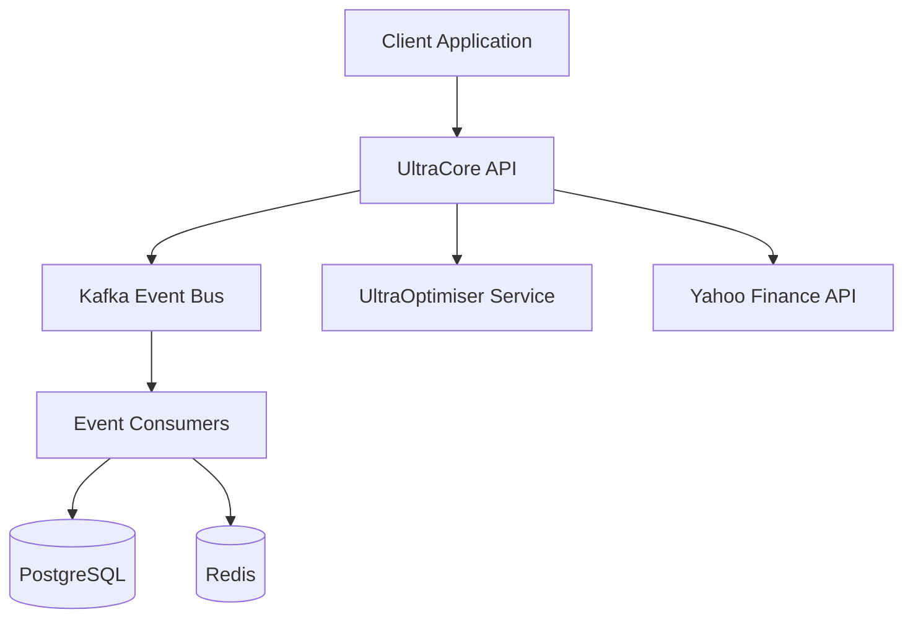

# UltraCore: Institutional-Grade Repository Improvement Plan

**Repository:** https://github.com/TuringDynamics3000/UltraCore  
**Current Status:** Production-ready but lacks institutional navigation/structure  
**Target:** Institutional-grade repository with excellent navigability

---

## 🎯 Executive Summary

**Current State Analysis:**
- ✅ **Strong technical foundation** - 276 directories, comprehensive functionality
- ✅ **Good documentation** - 20+ MD files, architecture docs
- ⚠️ **Poor navigability** - Documentation scattered, no clear entry points
- ⚠️ **Inconsistent structure** - Multiple README patterns, unclear hierarchy
- ❌ **No developer onboarding** - Missing getting started guide
- ❌ **No API documentation** - No OpenAPI/Swagger docs
- ❌ **No architecture diagrams** - Text-only documentation

**Institutional-Grade Requirements:**
1. **Clear Navigation** - 5-second rule (find anything in 5 seconds)
2. **Onboarding Path** - New developer productive in <2 hours
3. **API Documentation** - Interactive API explorer
4. **Architecture Visualization** - Diagrams, not just text
5. **Contribution Guidelines** - Clear process for contributors
6. **Quality Gates** - Automated checks, CI/CD visibility

---

## 📋 Improvement Plan (6 Phases)

### Phase 1: Documentation Restructuring (8-12 hours)
**Goal:** Create clear documentation hierarchy and navigation

#### 1.1 Create Master Documentation Hub
**File:** `README.md` (rewrite)

**Structure:**
```markdown
# UltraCore - Enterprise Banking Platform

[Badges: Build | Coverage | License | Version]

## 🚀 Quick Links
- [Getting Started](#) → New developers start here
- [Architecture](#) → System design and patterns
- [API Documentation](#) → Interactive API explorer
- [Developer Guide](#) → Development workflows
- [Deployment](#) → Production deployment guide

## 📊 What is UltraCore?
[2-3 paragraph overview]

## 🎯 Key Features
[Feature grid with icons]

## 🏗️ Architecture Overview
[High-level architecture diagram]

## 📚 Documentation
[Organized documentation tree]

## 🤝 Contributing
[Link to CONTRIBUTING.md]
```

**Estimated time:** 2-3 hours

---

#### 1.2 Reorganize Documentation
**Current:** 20+ MD files in root directory (cluttered)  
**Target:** Organized `/docs` structure

**Proposed Structure:**
```
docs/
├── README.md                          # Documentation index
├── getting-started/
│   ├── README.md                      # Getting started hub
│   ├── installation.md                # Installation guide
│   ├── quick-start.md                 # 5-minute quick start
│   ├── first-contribution.md          # First contribution guide
│   └── troubleshooting.md             # Common issues
├── architecture/
│   ├── README.md                      # Architecture hub
│   ├── overview.md                    # System overview
│   ├── kafka-first.md                 # Event sourcing
│   ├── multi-tenancy.md               # Multi-tenancy design
│   ├── data-mesh.md                   # Data mesh architecture
│   ├── investment-pods.md             # Investment Pods
│   ├── security.md                    # Security architecture
│   └── diagrams/                      # Architecture diagrams
│       ├── system-context.mmd
│       ├── event-flow.mmd
│       ├── data-mesh.mmd
│       └── deployment.mmd
├── api/
│   ├── README.md                      # API documentation hub
│   ├── rest-api.md                    # REST API guide
│   ├── mcp-tools.md                   # MCP tools reference
│   ├── webhooks.md                    # Webhook documentation
│   └── openapi.yaml                   # OpenAPI specification
├── modules/
│   ├── README.md                      # Modules index
│   ├── accounting.md                  # Accounting module
│   ├── cash-management.md             # Cash management
│   ├── holdings.md                    # Holdings module
│   ├── investment-pods.md             # Investment Pods
│   ├── multi-currency.md              # Multi-currency
│   ├── permissions.md                 # Permissions/RBAC
│   ├── reporting.md                   # Financial reporting
│   ├── rules-engine.md                # Rules engine
│   ├── scheduler.md                   # Job scheduler
│   ├── search.md                      # Search functionality
│   ├── trading.md                     # Trading module
│   └── fees.md                        # Fee management
├── development/
│   ├── README.md                      # Development hub
│   ├── setup.md                       # Development setup
│   ├── coding-standards.md            # Coding standards
│   ├── testing.md                     # Testing guide
│   ├── debugging.md                   # Debugging guide
│   ├── database-migrations.md         # Database migrations
│   └── performance.md                 # Performance optimization
├── deployment/
│   ├── README.md                      # Deployment hub
│   ├── docker.md                      # Docker deployment
│   ├── kubernetes.md                  # Kubernetes deployment
│   ├── aws.md                         # AWS deployment
│   ├── monitoring.md                  # Monitoring setup
│   └── security.md                    # Production security
├── compliance/
│   ├── README.md                      # Compliance hub
│   ├── australian-compliance.md       # Australian regulations
│   ├── data-privacy.md                # Data privacy (GDPR, etc.)
│   ├── security-audit.md              # Security audit logs
│   └── confidentiality.md             # Confidentiality requirements
└── reference/
    ├── README.md                      # Reference hub
    ├── database-schema.md             # Database schema
    ├── event-catalog.md               # Event catalog
    ├── error-codes.md                 # Error code reference
    └── glossary.md                    # Terminology glossary
```

**Actions:**
1. Create `/docs` structure
2. Move existing MD files to appropriate locations
3. Create missing documentation files
4. Add README.md to each directory as navigation hub

**Estimated time:** 4-5 hours

---

#### 1.3 Create Architecture Diagrams
**Tool:** Mermaid (renders in GitHub)

**Diagrams to create:**
1. **System Context Diagram** - UltraCore in ecosystem
2. **Event Flow Diagram** - Kafka-first architecture
3. **Data Mesh Diagram** - Data products and ownership
4. **Deployment Diagram** - Infrastructure layout
5. **Security Architecture** - Authentication/authorization flow
6. **Investment Pods Flow** - Pod lifecycle

**Example:**


**Estimated time:** 2-3 hours

---

### Phase 2: Developer Onboarding (6-8 hours)
**Goal:** New developer productive in <2 hours

#### 2.1 Create Getting Started Guide
**File:** `docs/getting-started/README.md`

**Content:**
- Prerequisites (Python 3.11+, Docker, etc.)
- Installation steps (clone, install, configure)
- Run development server
- Run tests
- Make first API call
- Common issues and solutions

**Estimated time:** 2-3 hours

---

#### 2.2 Create Development Environment Setup
**File:** `docs/development/setup.md`

**Content:**
- IDE setup (VSCode, PyCharm)
- Pre-commit hooks
- Environment variables
- Database setup
- Kafka setup (Docker Compose)
- Running tests
- Debugging configuration

**Estimated time:** 2-3 hours

---

#### 2.3 Create First Contribution Guide
**File:** `docs/getting-started/first-contribution.md`

**Content:**
- Fork and clone
- Create feature branch
- Make changes
- Run tests
- Submit PR
- Code review process

**Estimated time:** 1-2 hours

---

### Phase 3: API Documentation (8-10 hours)
**Goal:** Interactive API documentation

#### 3.1 Generate OpenAPI Specification
**Tool:** FastAPI automatic OpenAPI generation

**Actions:**
1. Ensure all endpoints have docstrings
2. Add request/response models
3. Add examples
4. Generate `openapi.yaml`
5. Host Swagger UI at `/docs`
6. Host ReDoc at `/redoc`

**Estimated time:** 4-5 hours

---

#### 3.2 Document MCP Tools
**File:** `docs/api/mcp-tools.md`

**Content:**
- MCP tool registry
- Available tools by category
- Tool parameters and responses
- Usage examples
- Security considerations

**Estimated time:** 2-3 hours

---

#### 3.3 Create API Usage Guide
**File:** `docs/api/README.md`

**Content:**
- Authentication
- Rate limiting
- Error handling
- Pagination
- Filtering and sorting
- Webhooks
- Best practices

**Estimated time:** 2-3 hours

---

### Phase 4: Code Navigation (4-6 hours)
**Goal:** Find any component in <5 seconds

#### 4.1 Create Module Index
**File:** `docs/modules/README.md`

**Content:**
- Module overview table
- Module dependencies diagram
- Quick links to each module
- Module status (stable, beta, deprecated)

**Estimated time:** 2-3 hours

---

#### 4.2 Add Module README Files
**Pattern:** Each module gets a README.md

**Template:**
```markdown
# [Module Name]

## Overview
[What this module does]

## Key Components
- Component 1: [description]
- Component 2: [description]

## Usage Examples
[Code examples]

## API Reference
[Link to API docs]

## Architecture
[Module architecture diagram]

## Testing
[How to test this module]

## Related Modules
[Links to related modules]
```

**Estimated time:** 2-3 hours (for top 10 modules)

---

### Phase 5: Quality Gates (6-8 hours)
**Goal:** Automated quality checks

#### 5.1 CI/CD Pipeline
**File:** `.github/workflows/ci.yml`

**Checks:**
- Linting (ruff, black)
- Type checking (mypy)
- Unit tests (pytest)
- Integration tests
- Coverage report (>80%)
- Security scan (bandit)
- Dependency audit

**Estimated time:** 3-4 hours

---

#### 5.2 Pre-commit Hooks
**File:** `.pre-commit-config.yaml`

**Hooks:**
- Black (formatting)
- Ruff (linting)
- Mypy (type checking)
- Trailing whitespace
- YAML validation
- Large file check

**Estimated time:** 1-2 hours

---

#### 5.3 Code Quality Badges
**File:** `README.md` (update)

**Badges to add:**
- Build status
- Test coverage
- Code quality (CodeClimate/SonarQube)
- Security score
- License
- Python version
- Last commit

**Estimated time:** 1-2 hours

---

### Phase 6: Repository Metadata (2-4 hours)
**Goal:** Professional repository presentation

#### 6.1 GitHub Repository Settings
**Actions:**
- Add repository description
- Add topics/tags (fintech, banking, event-sourcing, kafka, python, fastapi)
- Set up GitHub Pages for documentation
- Configure branch protection rules
- Set up issue templates
- Set up PR templates (already exists)

**Estimated time:** 1-2 hours

---

#### 6.2 Create CONTRIBUTING.md
**File:** `CONTRIBUTING.md` (enhance existing)

**Content:**
- Code of conduct
- Development workflow
- Coding standards
- Testing requirements
- Documentation requirements
- PR process
- Issue reporting

**Estimated time:** 1-2 hours

---

## 📊 Before/After Comparison

| Aspect | Before | After |
|--------|--------|-------|
| **Time to find documentation** | 5-10 minutes | <5 seconds |
| **New developer onboarding** | 1-2 days | <2 hours |
| **API documentation** | None | Interactive Swagger UI |
| **Architecture understanding** | Text only | Visual diagrams |
| **Code navigation** | Manual search | Indexed modules |
| **Quality visibility** | None | CI/CD badges |
| **Contribution clarity** | Unclear | Step-by-step guide |

---

## ⏱️ Total Effort Estimate

| Phase | Effort | Priority |
|-------|--------|----------|
| 1. Documentation Restructuring | 8-12 hours | **HIGH** |
| 2. Developer Onboarding | 6-8 hours | **HIGH** |
| 3. API Documentation | 8-10 hours | **MEDIUM** |
| 4. Code Navigation | 4-6 hours | **MEDIUM** |
| 5. Quality Gates | 6-8 hours | **HIGH** |
| 6. Repository Metadata | 2-4 hours | **LOW** |
| **TOTAL** | **34-48 hours** | **(5-6 days)** |

---

## 🎯 Success Metrics

1. **Navigation Speed** - Find any documentation in <5 seconds
2. **Onboarding Time** - New developer productive in <2 hours
3. **API Discoverability** - All endpoints documented in Swagger UI
4. **Code Quality** - >80% test coverage, all CI checks passing
5. **Contribution Rate** - Increase external contributions by 50%
6. **Documentation Coverage** - All modules have README.md

---

## 🚀 Implementation Approach

### Option A: Big Bang (5-6 days)
**Pros:** Complete transformation, consistent quality  
**Cons:** Disruptive, high upfront cost

### Option B: Incremental (2-3 weeks)
**Pros:** Less disruptive, iterative improvement  
**Cons:** Temporary inconsistency, longer timeline

### Option C: Hybrid (Recommended)
**Week 1:** Phase 1 + Phase 2 (Documentation + Onboarding)  
**Week 2:** Phase 3 + Phase 5 (API Docs + Quality Gates)  
**Week 3:** Phase 4 + Phase 6 (Navigation + Metadata)

---

## 📋 Quick Wins (Can do immediately)

1. **Add repository description** (5 minutes)
2. **Add topics/tags** (5 minutes)
3. **Create docs/ directory** (10 minutes)
4. **Add badges to README** (15 minutes)
5. **Create getting-started/ directory** (10 minutes)
6. **Add architecture diagrams** (2-3 hours)

---

## 🤔 Discussion Points

Before we implement, let's discuss:

1. **Priority:** Which phases are most important to you?
2. **Timeline:** Big bang (5-6 days) or incremental (2-3 weeks)?
3. **Documentation Style:** Detailed vs. concise?
4. **Diagram Tool:** Mermaid (GitHub native) vs. external tool?
5. **API Documentation:** Swagger UI only or also ReDoc?
6. **Quality Gates:** Which checks are mandatory vs. optional?
7. **Module Coverage:** Document all modules or top 20?
8. **External Contributions:** Open to external contributors?

---

## 📞 Next Steps

1. **Review this plan** - Discuss priorities and approach
2. **Agree on scope** - Which phases to implement
3. **Set timeline** - Big bang vs. incremental
4. **Start implementation** - Begin with Phase 1

---

**Questions to consider:**
- Do you want to maintain the current README style or completely redesign it?
- Should we create a separate documentation site (GitHub Pages) or keep everything in markdown?
- Are there specific institutional standards you need to comply with (e.g., SOC 2, ISO 27001)?
- Do you want to add contributor license agreements (CLA)?
- Should we create a changelog (CHANGELOG.md)?
- Do you want versioning and release notes?

Let's discuss before we implement! 🚀
