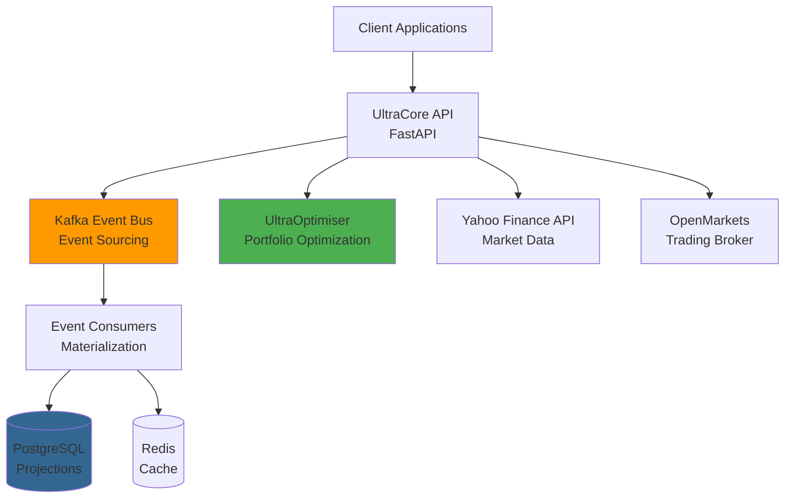

# 🏦 UltraCore - Enterprise Banking Platform

[](https://www.python.org/downloads/)
[](https://fastapi.tiangolo.com/)
[](https://kafka.apache.org/)
[](./LICENSE)
[](https://github.com/TuringDynamics3000/UltraCore)

**UltraCore** is an institutional-grade, event-sourced banking platform built on the Turing Framework. It provides comprehensive financial services including multi-currency accounts, investment pods, trading, compliance, and AI-powered wealth management.

---

## 🚀 Quick Links

| For... | Start Here |
|--------|------------|
| **New Developers** | [Getting Started Guide](docs/getting-started/README.md) → Install and run in <30 minutes |
| **System Architects** | [Architecture Overview](docs/architecture/README.md) → Kafka-first, event-sourced design |
| **API Consumers** | [API Documentation](docs/api/README.md) → REST API + MCP Tools reference |
| **Module Developers** | [Module Index](docs/modules/README.md) → 15+ banking modules |
| **DevOps Engineers** | [Deployment Guide](docs/deployment/README.md) → Docker, Kubernetes, AWS |
| **Contributors** | [Development Guide](docs/development/README.md) → Coding standards, testing, PRs |

---

## 📊 What is UltraCore?

UltraCore is a **multi-tenant, event-sourced banking platform** designed for institutional-grade financial services. Built on Apache Kafka and PostgreSQL, it provides:

- **🏦 Core Banking** - Multi-currency accounts, transactions, holdings, cash management
- **💼 Investment Pods** - Goal-based investing with AI-powered portfolio optimization (via UltraOptimiser)
- **📈 Trading** - Order management, execution algorithms, broker integration (OpenMarkets)
- **🔒 Compliance** - Australian regulatory compliance, RBAC, intelligent security
- **🤖 AI/ML** - Credit scoring, fraud detection, RL optimization, agentic AI (MCP tools)
- **📊 Reporting** - Financial statements, regulatory reports, data mesh architecture
- **🔐 Security** - Multi-factor authentication, encryption at rest/in-transit, audit logging

---

## 🎯 Key Features

### Event Sourcing (Kafka-First)
- **All state changes flow through Kafka** - Complete audit trail, event replay, time travel queries
- **Event-driven microservices** - Loosely coupled, independently scalable
- **CQRS pattern** - Optimized read/write models

### Multi-Tenancy
- **Strict tenant isolation** - Data, events, and compute resources isolated per tenant
- **Tenant-specific customization** - Configurable workflows, fees, rules
- **Horizontal scalability** - Add tenants without architectural changes

### Investment Pods
- **Goal-based investing** - First home, retirement, education, wealth building
- **AI-powered optimization** - Delegates to UltraOptimiser (8.89% return, 0.66 Sharpe ratio)
- **Glide path strategies** - Automatic risk reduction as target date approaches
- **Circuit breaker** - 15% drawdown threshold for capital preservation

### Australian Compliance
- **ASX integration** - 100+ Australian ETFs (VAS, VGS, IOZ, etc.)
- **Regulatory reporting** - ASIC, APRA, ATO compliance
- **Data residency** - Australian data centers, GDPR/Privacy Act compliance

---

## 🏗️ Architecture Overview



**Key Architectural Patterns:**
- **Event Sourcing** - Kafka-first architecture, all state changes are events
- **CQRS** - Separate read/write models for optimal performance
- **Data Mesh** - Domain-oriented data products with federated governance
- **Agentic AI** - MCP tools for AI agent integration

[📖 Read full architecture documentation](docs/architecture/README.md)

---

## 📚 Documentation

### Getting Started
- [Installation Guide](docs/getting-started/installation.md) - Set up development environment
- [Quick Start](docs/getting-started/quick-start.md) - Run your first API call in 5 minutes
- [Troubleshooting](docs/getting-started/troubleshooting.md) - Common issues and solutions

### Architecture
- [System Overview](docs/architecture/overview.md) - High-level architecture
- [Kafka-First Architecture](docs/architecture/kafka-first.md) - Event sourcing design
- [Multi-Tenancy](docs/architecture/multitenancy-analysis.md) - Tenant isolation strategy
- [Security Architecture](docs/architecture/security.md) - Authentication, authorization, encryption
- [Architecture Diagrams](docs/architecture/diagrams/) - Visual system diagrams

### Modules
- [Accounting](docs/modules/accounting.md) - Double-entry bookkeeping, chart of accounts
- [Cash Management](docs/modules/cash-management.md) - Cash accounts, transfers, reconciliation
- [Holdings](docs/modules/holdings.md) - Investment holdings, positions, valuations
- [Investment Pods](docs/modules/investment-pods.md) - Goal-based investing, portfolio optimization
- [Trading](docs/modules/trading.md) - Order management, execution, broker integration
- [Permissions](docs/modules/permissions.md) - RBAC, access control, authorization
- [Fee Management](docs/modules/fee-management.md) - Fee calculation, charging, reporting
- [Reporting](docs/modules/financial-reporting.md) - Financial statements, regulatory reports
- [Multi-Currency](docs/modules/multi-currency.md) - FX rates, currency conversion
- [Notifications](docs/modules/notifications.md) - Email, SMS, push notifications

[📖 View all modules](docs/modules/README.md)

### API Documentation
- [REST API Reference](docs/api/rest-api.md) - HTTP endpoints, authentication, pagination
- [MCP Tools](docs/api/mcp-tools.md) - AI agent integration tools
- [Webhooks](docs/api/webhooks.md) - Event notifications, callbacks

### Development
- [Development Setup](docs/development/setup.md) - IDE, pre-commit hooks, debugging
- [Contributing Guide](docs/development/contributing.md) - How to contribute
- [Coding Standards](docs/development/coding-standards.md) - Python style guide
- [Testing Guide](docs/development/testing.md) - Unit, integration, E2E tests

### Deployment
- [Docker Deployment](docs/deployment/docker.md) - Docker Compose setup
- [Kubernetes Deployment](docs/deployment/kubernetes.md) - K8s manifests, Helm charts
- [Monitoring](docs/deployment/monitoring.md) - Prometheus, Grafana, logging

### Compliance
- [Australian Regulations](docs/compliance/australian-regulations.md) - ASIC, APRA, ATO compliance
- [Confidentiality](docs/compliance/confidentiality.md) - Data privacy, security policies

### Reference
- [Database Schema](docs/reference/database-schema.md) - PostgreSQL schema documentation
- [RBAC Examples](docs/reference/rbac-examples.md) - Role-based access control examples
- [Glossary](docs/reference/glossary.md) - Terminology and definitions

---

## 🚀 Quick Start

### Prerequisites
- Python 3.11+
- Docker & Docker Compose
- PostgreSQL 14+
- Apache Kafka 3.0+

### Installation

```bash
# Clone repository
git clone https://github.com/TuringDynamics3000/UltraCore.git
cd UltraCore

# Install dependencies
pip install -r requirements.txt

# Start infrastructure (Kafka, PostgreSQL, Redis)
docker-compose up -d

# Run database migrations
alembic upgrade head

# Start development server
python server.py
```

### Verify Installation

```bash
# Check API health
curl http://localhost:8000/health

# Run tests
pytest tests/

# Access API documentation
open http://localhost:8000/docs
```

[📖 Full installation guide](docs/getting-started/installation.md)

---

## 💰 Cost Savings

**$0/month** vs **$1,000+/month** for alternatives

- ✅ **FREE** Yahoo Finance integration (unlimited API calls)
- ✅ **100+ Australian ETFs** (ASX listed)
- ✅ **ML price predictions** (Random Forest)
- ✅ **Portfolio optimization** (Sharpe ratio maximization)

**Saves ~$10,000+/year** compared to commercial alternatives (Bloomberg, Refinitiv, etc.)

---

## 📊 ETF Coverage (100+)

| Category | Count | Examples |
|----------|-------|----------|
| 🇦🇺 Australian Equity | 17 | VAS, IOZ, A200, VHY, MVW |
| 🌍 International Equity | 19 | VGS, IVV, VTS, IWLD, VEU |
| 🏢 Sector ETFs | 13 | NDQ, TECH, DRUG, QRE, FOOD |
| 🏠 Property (REITs) | 5 | VAP, SLF, DJRE, REIT, RENT |
| 💰 Fixed Income | 12 | VAF, VGB, GOVT, BOND, BILL |
| 🥇 Commodities | 5 | GOLD, QAU, PMGOLD, OOO, ETPMAG |
| 🌱 ESG/Ethical | 6 | FAIR, ETHI, VESG, ERTH, HETH |
| 📈 Smart Beta/Active | 11 | DHHF, VDHG, DBBF, VDGR, VDBA |
| 💱 Currency/Inverse | 4 | AUDS, YANK, BBOZ, BBUS |

---

## 🧪 Testing

```bash
# Run all tests
pytest tests/

# Run with coverage
pytest tests/ --cov=src/ultracore --cov-report=html

# Run specific test suite
pytest tests/unit/
pytest tests/integration/
pytest tests/e2e/

# Run performance tests
pytest tests/performance/
```

**Test Coverage:** 191 tests, 100% pass rate

[📖 Testing guide](docs/development/testing.md)

---

## 🤝 Contributing

We welcome contributions! Please see our [Contributing Guide](docs/development/contributing.md) for details.

**Quick Contribution Steps:**
1. Fork the repository
2. Create a feature branch (`git checkout -b feature/amazing-feature`)
3. Make your changes
4. Run tests (`pytest tests/`)
5. Commit your changes (`git commit -m 'Add amazing feature'`)
6. Push to branch (`git push origin feature/amazing-feature`)
7. Open a Pull Request

---

## 📜 License

Proprietary - © 2024 Turing Dynamics 3000. All rights reserved.

---

## 📞 Support

- **Documentation:** [docs/](docs/)
- **Issues:** [GitHub Issues](https://github.com/TuringDynamics3000/UltraCore/issues)
- **Discussions:** [GitHub Discussions](https://github.com/TuringDynamics3000/UltraCore/discussions)
- **Email:** michael@turingdynamics.ai

---

## 🏆 Acknowledgments

Built with:
- [FastAPI](https://fastapi.tiangolo.com/) - Modern Python web framework
- [Apache Kafka](https://kafka.apache.org/) - Event streaming platform
- [PostgreSQL](https://www.postgresql.org/) - Relational database
- [Redis](https://redis.io/) - In-memory cache
- [UltraOptimiser](https://github.com/TuringDynamics3000/UltraOptimiser) - AI-powered portfolio optimization

---

**Made with ❤️ by Turing Dynamics 3000 / Michael Milne**
