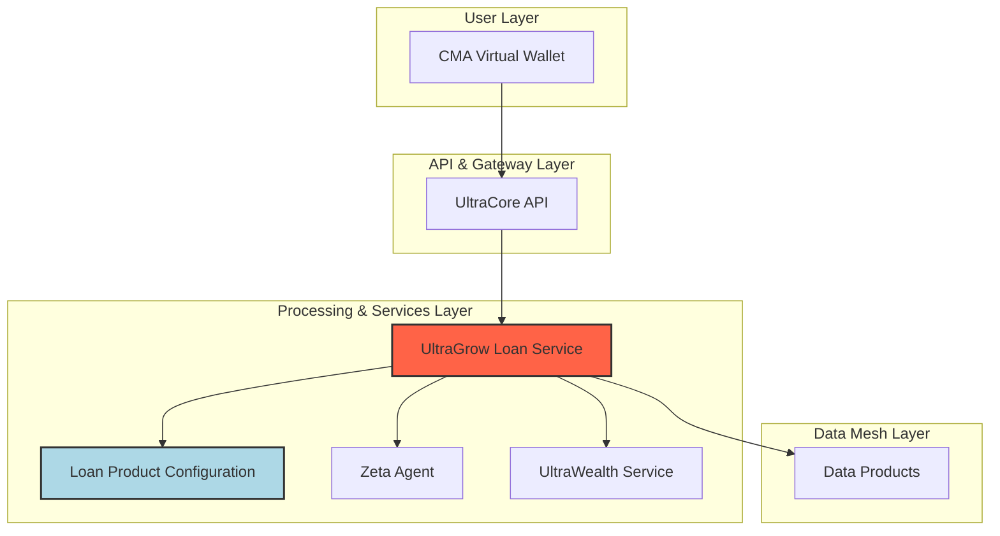

# UltraGrow Loan: Flexible Investment Financing

**Author:** Manus AI  
**Date:** November 15, 2025  
**Version:** 1.0.0  
**Status:** Design Proposal

---

## 1. Executive Summary

The **UltraGrow Loan** is a revolutionary investment financing facility designed to democratize access to UltraWealth investment pods. It allows customers to purchase investment portfolios with a small upfront payment, financing the rest through a flexible, fixed-fee installment plan. The investment pod itself serves as collateral, creating a secure and scalable lending model.

This document outlines the strategic vision, core features, and flexible architecture of the UltraGrow Loan system, positioning it as a key driver of customer acquisition and AUM growth for the UltraCore platform.

---

## 2. Core Product Concept: "Invest Now, Pay Later"

The UltraGrow Loan enables customers to invest in UltraWealth pods without needing the full capital upfront. This removes the single biggest barrier to entry for new investors and allows existing customers to accelerate their wealth-building journey.

### 2.1 The Customer Journey

1.  **Select & Finance:** A customer wants to purchase a $10,000 UltraWealth Gamma pod. They choose the UltraGrow Loan option and pay a 20% down payment ($2,000).
2.  **Instant Ownership:** The full $10,000 pod is purchased and appears in their portfolio immediately. They have full ownership from day one.
3.  **Installment Plan:** The remaining $8,000 is financed over a 4-month term. The customer makes four equal monthly payments of $2,000.
4.  **Fixed Facility Fee:** Instead of interest, a fixed facility fee is charged. Based on a 20% annual rate, the total fee is calculated upfront and paid in monthly installments alongside the principal.
5.  **Wealth Building:** The customer benefits from any market appreciation and dividends from the full $10,000 investment, even while making payments.

### 2.2 Key Differentiators

-   **No Interest, Fixed Fee:** Simple, transparent pricing. The fee is calculated once and does not change, making it easy for customers to budget.
-   **Immediate Ownership:** Customers benefit from market exposure on the full investment amount from day one.
-   **Secured by the Investment:** The pod itself is the collateral, reducing risk for the lender and enabling lower financing costs for the borrower.
-   **Flexible by Design:** The architecture supports configurable terms, fees, LTV ratios, and lending limits to adapt to market needs.

---

## 3. Flexible Architecture & Configurable Parameters

The UltraGrow Loan system is designed for maximum flexibility, allowing for the creation of multiple loan products from a single, robust architecture. All parameters are stored in a central **Loan Product Configuration** table, enabling rapid product development and iteration without code changes.

### 3.1 Core Configurable Parameters

| Parameter | Description | Default Value | Example Values |
|---|---|---|---|
| **Loan-to-Value (LTV) Ratio** | The percentage of the investment pod's value that can be financed. | 80% | 50%, 75%, 90% |
| **Loan Term (Months)** | The duration of the installment plan. | 4 months | 3, 6, 12, 24 months |
| **Repayment Frequency** | How often payments are due. | Monthly | Bi-weekly, Weekly |
| **Facility Fee Rate (Annual)** | The annual rate used to calculate the fixed facility fee. | 20% | 10%, 15%, 25% |
| **Fee Calculation Method** | How the fee is calculated (e.g., on initial principal, pro-rata). | Pro-rata on term | Flat fee, daily accrual |
| **Minimum Lending Limit** | The smallest loan amount allowed. | $1,000 | $500, $2,000 |
| **Maximum Lending Limit** | The largest loan amount allowed. | $50,000 | $100,000, $250,000 |
| **Eligible Collateral** | Which UltraWealth pods can be used as collateral. | All Pods | Alpha & Beta only, ESG pods only |

### 3.2 System Architecture Diagram

### 3.3 Component Responsibilities

-   **UltraGrow Loan Service:** The core microservice that manages the entire loan lifecycle, from origination to closure. It reads from the `Loan Product Configuration` to determine the terms for each loan.
-   **Loan Product Configuration:** A database table or configuration file that stores all the flexible parameters for different loan products. This allows new products (e.g., a "Student Investor Loan" with a 95% LTV and 12-month term) to be launched by simply adding a new entry.
-   **Zeta Agent:** The existing credit risk RL agent is used to assess the customer's ability to repay the loan, even though it is secured. A high-risk customer might be offered a lower LTV or a shorter term.
-   **UltraWealth Service:** Provides real-time valuation of the investment pod and places a lien on the assets once the loan is active.

---

## 4. Fee Calculation Example

This example demonstrates the fixed facility fee calculation.

-   **Investment Pod Value:** $10,000
-   **LTV:** 80%
-   **Down Payment (20%):** $2,000
-   **Loan Principal:** $8,000
-   **Loan Term:** 4 months
-   **Facility Fee Rate (Annual):** 20%

**Calculation:**

1.  **Annual Fee:** `Loan Principal * Annual Fee Rate` = `$8,000 * 0.20` = `$1,600`
2.  **Pro-Rata Term Adjustment:** `Annual Fee * (Loan Term / 12)` = `$1,600 * (4 / 12)` = `$533.33`
3.  **Total Amount to Repay:** `Loan Principal + Total Fee` = `$8,000 + $533.33` = `$8,533.33`
4.  **Monthly Installment:** `Total Amount to Repay / Loan Term` = `$8,533.33 / 4` = `$2,133.33`

**Customer Payment Schedule:**

-   **Day 1:** $2,000 (Down Payment)
-   **Month 1:** $2,133.33
-   **Month 2:** $2,133.33
-   **Month 3:** $2,133.33
-   **Month 4:** $2,133.33

**Total Cost to Customer:** `$2,000 + $8,533.33` = `$10,533.33` for a $10,000 investment.

---

## 5. Strategic Advantages

-   **Customer Acquisition:** The low barrier to entry will attract a new generation of investors to the UltraCore platform.
-   **AUM Growth:** Directly fuels the growth of Assets Under Management in the UltraWealth module.
-   **Predictable Revenue:** The fixed-fee model provides a clear and predictable revenue stream for the business.
-   **Product Velocity:** The flexible architecture allows for the rapid launch of new, targeted loan products to meet specific market demands.
-   **Data Flywheel:** Every loan provides valuable data to train the Zeta Agent, further improving its risk assessment capabilities and allowing for more competitive loan terms over time.

This design provides a robust and flexible foundation for the UltraGrow Loan system, creating a powerful engine for growth and innovation within the UltraCore ecosystem.
